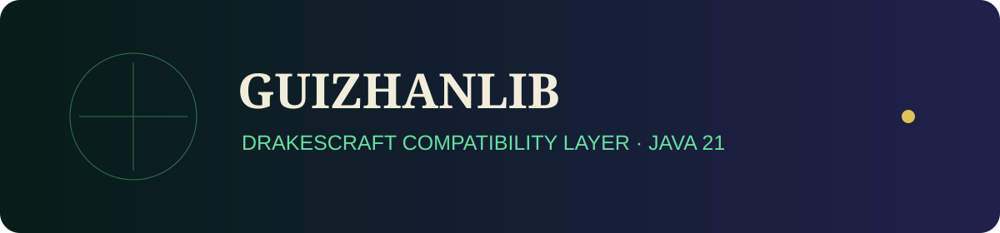

<p align="center"></p>

# GuizhanLib for DrakesCraft

> ### 🏰 ¡Únete a la Comunidad Oficial de DrakesCraft!
> 
> * 🎮 **IP del Servidor**: `play.drakescraft.net` *(Java 1.21.11 & Bedrock)*
> * 💬 **Discord Oficial**: [discord.gg/drakescraft](https://discord.gg/rv3vtXZTk7)
> * 🌐 **Web & Guía**: [drakescraft.net](https://drakescraft.net) — 🛒 **Tienda**: [tienda.drakescraft.net](https://tienda.drakescraft.net)
> 
> *¡Juega con este addon y más de 80 expansiones optimizadas en vivo en nuestra network de supervivencia técnica!*

---

Compatibility port of GuizhanLib for Java 21, Paper/Purpur 1.21.11 and the repackaged DrakesCraft Slimefun core.

It provides the common, localization, Minecraft and Slimefun APIs required by maintained DrakesCraft addons. The Chinese-core storage adapter and runtime updater are intentionally excluded because they target a different storage implementation and deployment model.

```bash
./gradlew :guizhanlib-all:publishToMavenLocal -x test
```

Artifact: `com.github.drakescraft_labs:guizhanlib-all:2.5.0-Drake-1.21.11`.

The original project by ybw0014 and its GPL-3.0 license are preserved.

## ⚖️ Upstream Attribution & License / Licencia y Créditos

- **Original Project / Upstream**: Slimefun4 Community Addon.
- **Port & Maintenance**: DrakesCraft Labs team (Compatibility for Paper / Purpur 1.21.11).
- **License**: GPL-3.0 / MIT.
- **Source Code**: [GitHub Repository](https://github.com/DrakesCraft-Labs/GuizhanLib)
- **Support & Issues**: [GitHub Issues](https://github.com/DrakesCraft-Labs/GuizhanLib/issues) | [Discord](https://discord.gg/rv3vtXZTk7)

*This project is an open-source derivative work maintained by DrakesCraft Labs under the terms of its original license. All original assets and concepts belong to their respective creators.*
